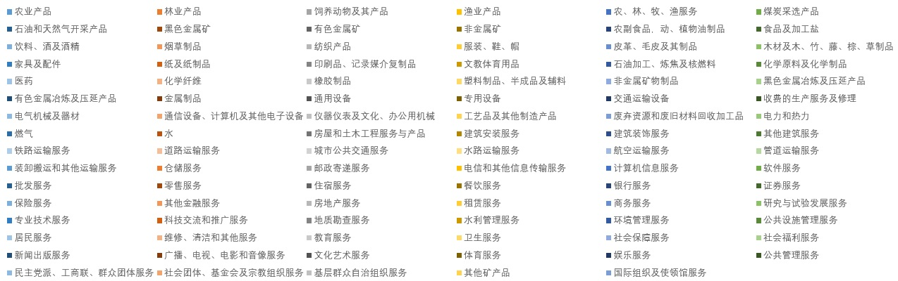
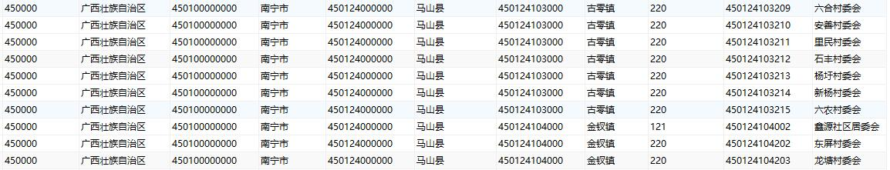
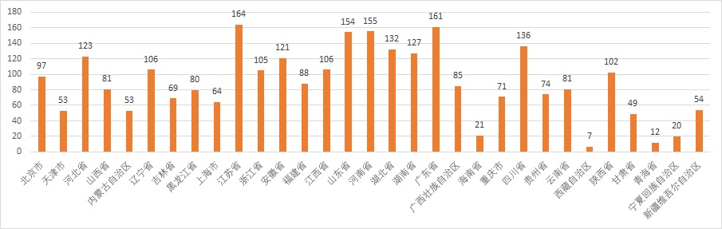
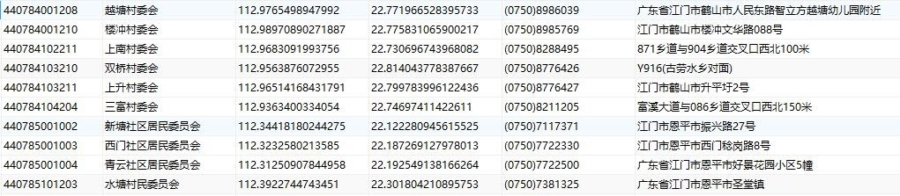

# region
提供全网最全、最精细的全国五级行政区域数据（精确到乡村）、乡村地理数据、景点数据、高校数据、行业分类数据等

## 如何使用
```
├── villages          # 乡村地理数据
├── china2020         # 五级行政区域数据（精确到乡村）
├── schools.sql       # 高校数据
```

### 乡村数据使用
```
将数据下载到本地，进入villages目录：cat villages.sql* > villages.sql 将文件合并为一个完整的sql数据包，即可使用；
```

###  五级行政区域数据（精确到乡村）
```
将数据下载到本地，进入china2020目录：cat china2020.sql* > china2020.sql 将文件合并为一个完整的sql数据包，即可使用；
```
## 示例








## 欢迎打赏

